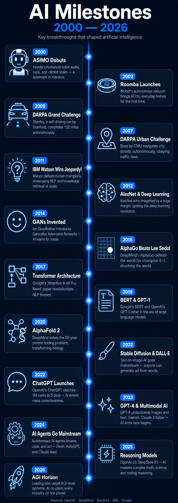
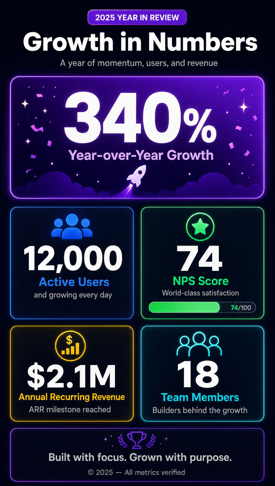
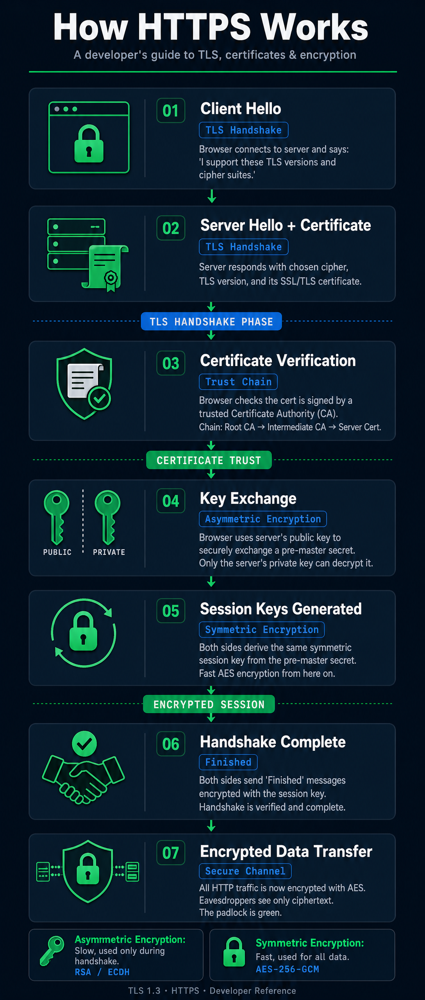
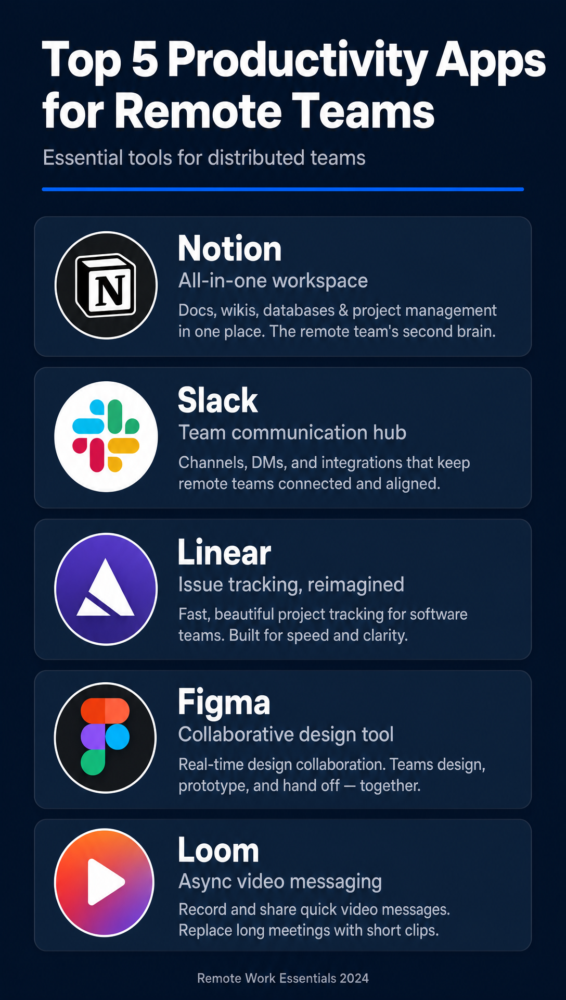
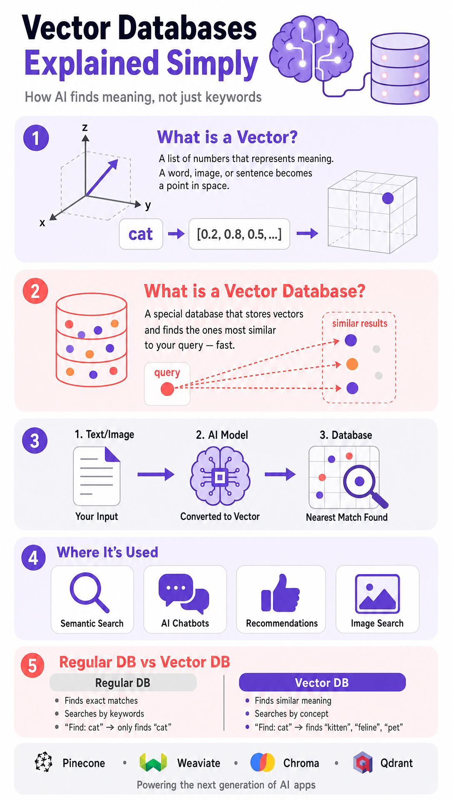

**Create a timeline of AI milestones from 2000 to 2025**

**We grew 340% in 2025. 12,000 active users. NPS score 74. $2.1M ARR. Team: 18 people. I wanna infographics**

**Explain how HTTPS works in simple steps for a developer blog in infographics**

**Make an infographic: top 5 productivity apps for remote teams — Notion, Slack, Linear, Figma, Loom**

**Flat educational infographic that visually explains the concept of "Vector Databases".**
